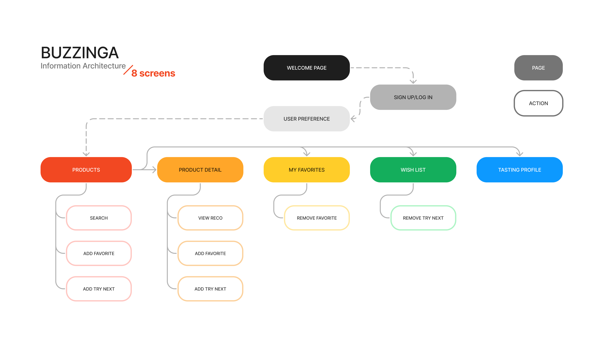

# Buzzinga Design Doc

## Table of Content

- [User Stories](#user-stories)
- [Information Architecture](#information-architecture)
- [User Flow](#user-flow)
- [Architecture](#architecture)
- [ERD](#erd)
- [Wireframes](#wireframes)
- [Planned Routes](#planned-routes)

## User Stories

- As a new user, I want to sign up via my Google, Facebook or Microsoft account
- As a returnning user, I want to log in via the same social account
- As a user, I want to choose my tasting preference, so that I can tailor the intial product display to my liking
- As a user, I want to search for a specific drink, so that I can quickly find the products I'm looking for
- As a user, I want to view a drink's details when I click on it, so that I can understand the product better
- As a user, I want to see similar product recommendations when I'm viewing any specific drink, so that I can get inspiration on what to try next
- As a logged-in user, I want to add drinks to my "Try Next" category, so that I can have a convenient wish list I can refer to later
- As a logged-in user, I want to add drinks to "My Favorites" category, so that I can keep track of my favorite drinks
- As a logged-in user, I want to view interesting statistics about my tasting profile compared to the population, so that I can understand my preference better

## Information Architecture

## User Flow

## Architecture

## ERD

## Wireframes

## Planned Routes
